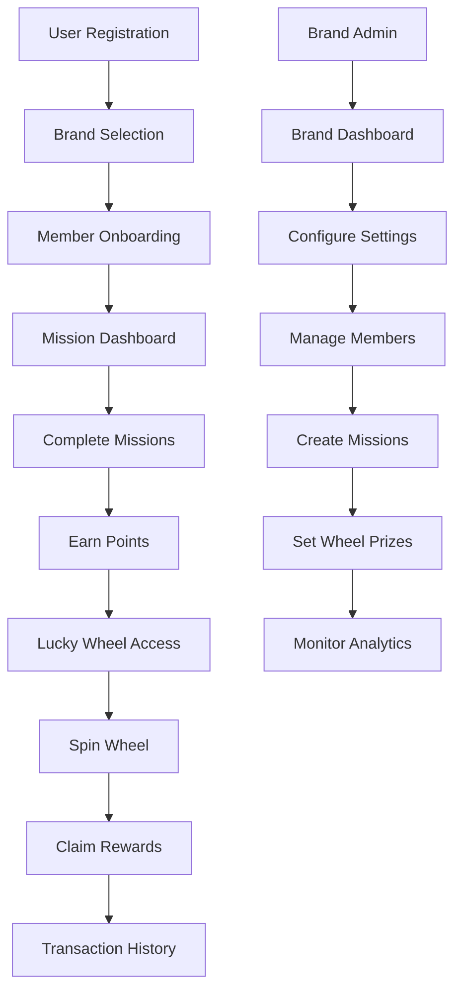

# Lucky Wheel Engagement Service - Product Requirements Document

## 1. Product Overview

A comprehensive Node.js backend service that provides brand-based multi-tenant engagement platform with lucky wheel, membership tiers, and quest/mission systems. The service enables brands to manage their own users, members, and engagement features independently while sharing the same infrastructure.

- **Primary Purpose**: Enable brands to run engagement campaigns with gamification features like lucky wheels, missions, and membership rewards
- **Target Users**: Brand administrators, system administrators, and end-users (members) of various brands
- **Market Value**: Scalable SaaS solution for brands to increase customer engagement and retention through gamified experiences

## 2. Core Features

### 2.1 User Roles

| Role | Registration Method | Core Permissions |
|------|---------------------|------------------|
| Super Admin | System invitation only | Full system access, brand management, global settings |
| Brand Admin | Brand invitation/approval | Full brand management, user/member management within brand |
| Brand Manager | Brand admin invitation | Limited brand management, content management |
| Brand User | Email/social registration | Basic brand access, can become members |
| Member | Upgrade from Brand User | Access to engagement features, lucky wheel, missions |

### 2.2 Feature Module

Our engagement service consists of the following main modules:

1. **Brand Management**: Brand settings, configuration, branding customization
2. **User Management**: User authentication, role assignment, brand association
3. **Member Management**: Member profiles, membership tiers, progression tracking
4. **Lucky Wheel System**: Wheel configuration, spin mechanics, prize management
5. **Quest/Mission System**: Mission creation, completion tracking, reward distribution
6. **Transaction System**: Points, rewards, payment processing, transaction history
7. **Audit & Logging**: User actions, system events, compliance tracking
8. **Admin Dashboard**: Analytics, reporting, system monitoring

### 2.3 Page Details

| Module | Feature Name | Feature Description |
|--------|--------------|--------------------|
| Brand Management | Brand Settings | Create, update brand profile, logo, colors, domain settings |
| Brand Management | Brand Configuration | Configure membership tiers, wheel settings, mission parameters |
| User Management | Authentication | Login, registration, password reset, JWT token management |
| User Management | Role Management | Assign roles, manage permissions, brand-specific access control |
| Member Management | Membership Tiers | Define tier levels, benefits, progression requirements |
| Member Management | Member Profiles | Track member progress, points, achievements, history |
| Lucky Wheel System | Wheel Configuration | Set up prizes, probabilities, spin limits, scheduling |
| Lucky Wheel System | Spin Mechanics | Process spins, validate eligibility, distribute rewards |
| Quest/Mission System | Mission Management | Create daily/weekly/monthly missions, set requirements |
| Quest/Mission System | Completion Tracking | Validate completions, distribute rewards, track progress |
| Transaction System | Points Management | Award points, deduct points, track balances |
| Transaction System | Transaction History | Record all transactions, generate reports |
| Audit & Logging | Action Logging | Log user actions, system events, security events |
| Admin Dashboard | Analytics | Display engagement metrics, user statistics, revenue data |

## 3. Core Process

### Brand Admin Flow
1. Brand Admin logs in → Access brand dashboard → Configure brand settings → Set up membership tiers → Create lucky wheel prizes → Design missions → Monitor analytics

### Member Flow
1. User registers → Joins brand → Becomes member → Completes missions → Earns points → Spins lucky wheel → Claims rewards → Views transaction history

### System Admin Flow
1. Super Admin logs in → Manages brands → Monitors system health → Reviews audit logs → Generates reports

## 4. User Interface Design

### 4.1 Design Style
- **Primary Colors**: Brand-customizable primary color, default #2563eb (blue)
- **Secondary Colors**: Gray scale (#f8fafc, #64748b, #1e293b)
- **Button Style**: Rounded corners (8px), gradient backgrounds, hover animations
- **Font**: Inter or system fonts, sizes 14px-24px for body, 32px+ for headings
- **Layout Style**: Card-based design, clean sidebar navigation, responsive grid
- **Icons**: Heroicons or Lucide icons, consistent 20px-24px sizing

### 4.2 Page Design Overview

| Module | Component | UI Elements |
|--------|-----------|-------------|
| Brand Dashboard | Overview Cards | Metrics cards with icons, gradient backgrounds, hover effects |
| Member Dashboard | Progress Bars | Animated progress indicators, point counters, level badges |
| Lucky Wheel | Wheel Component | SVG-based spinning wheel, particle effects, modal overlays |
| Mission System | Mission Cards | Card layout with progress bars, completion badges, reward displays |
| Transaction History | Data Table | Sortable columns, pagination, filter dropdowns, export buttons |
| Admin Panel | Analytics Charts | Chart.js integration, responsive charts, data visualization |

### 4.3 Responsiveness
Mobile-first responsive design with breakpoints at 640px, 768px, 1024px, and 1280px. Touch-optimized interactions for mobile devices with swipe gestures and larger touch targets.