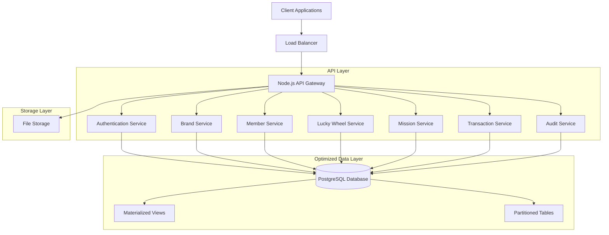
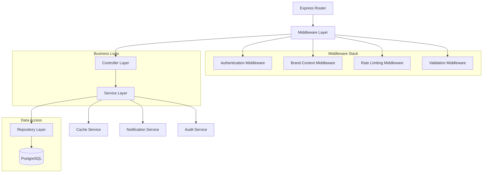
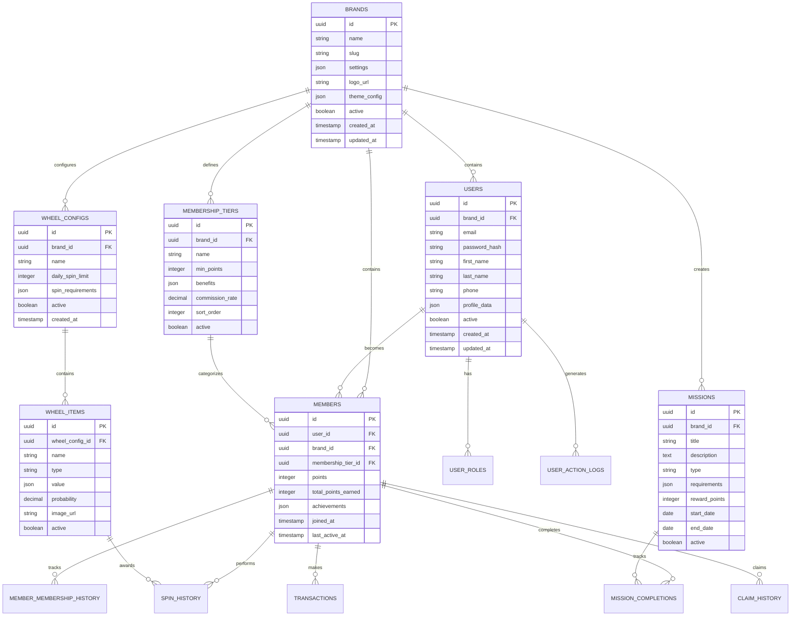

# Lucky Wheel Engagement Service - Technical Architecture

## 1. Architecture Design



## 2. Technology Description

* **Backend**: Node.js\@20 + Express.js\@4 + JavaScript

* **Database**: PostgreSQL\@15 with advanced performance optimization

* **Performance**: Table partitioning, materialized views, and optimized indexing

* **Authentication**: JWT tokens with refresh token rotation

* **Validation**: Joi for request validation

* **ORM**: pg (node-postgres) with custom query builder

* **File Upload**: Multer with cloud storage integration

* **Logging**: Winston with structured logging

* **Process Management**: PM2 for production deployment

* **Database Optimization**: Connection pooling, query optimization, and maintenance automation

## 3. Route Definitions

| Route                   | Purpose                                             |
| ----------------------- | --------------------------------------------------- |
| /api/v1/auth/\*         | Authentication endpoints (login, register, refresh) |
| /api/v1/brands/\*       | Brand management and configuration                  |
| /api/v1/users/\*        | User management and profile operations              |
| /api/v1/members/\*      | Member management and membership operations         |
| /api/v1/wheel/\*        | Lucky wheel configuration and spin operations       |
| /api/v1/missions/\*     | Quest/mission management and completion             |
| /api/v1/transactions/\* | Transaction history and points management           |
| /api/v1/admin/\*        | Administrative operations and analytics             |
| /api/v1/audit/\*        | Audit logs and compliance reporting                 |

## 4. API Definitions

### 4.1 Authentication APIs

**User Login**

```
POST /api/v1/auth/login
```

Request:

| Param Name | Param Type | isRequired | Description             |
| ---------- | ---------- | ---------- | ----------------------- |
| email      | string     | true       | User email address      |
| password   | string     | true       | User password           |
| brandId    | string     | false      | Brand context for login |

Response:

| Param Name   | Param Type | Description       |
| ------------ | ---------- | ----------------- |
| success      | boolean    | Login status      |
| token        | string     | JWT access token  |
| refreshToken | string     | JWT refresh token |
| user         | object     | User profile data |

**Member Registration**

```
POST /api/v1/auth/register
```

Request:

| Param Name | Param Type | isRequired | Description     |
| ---------- | ---------- | ---------- | --------------- |
| email      | string     | true       | User email      |
| password   | string     | true       | User password   |
| firstName  | string     | true       | User first name |
| lastName   | string     | true       | User last name  |
| brandId    | string     | true       | Brand to join   |

### 4.2 Lucky Wheel APIs

**Spin Wheel**

```
POST /api/v1/wheel/spin
```

Request:

| Param Name | Param Type | isRequired | Description            |
| ---------- | ---------- | ---------- | ---------------------- |
| wheelId    | string     | true       | Wheel configuration ID |
| memberId   | string     | true       | Member performing spin |

Response:

| Param Name     | Param Type | Description        |
| -------------- | ---------- | ------------------ |
| success        | boolean    | Spin result status |
| prize          | object     | Won prize details  |
| remainingSpins | number     | Daily spins left   |

### 4.3 Mission APIs

**Complete Mission**

```
POST /api/v1/missions/complete
```

Request:

| Param Name | Param Type | isRequired | Description           |
| ---------- | ---------- | ---------- | --------------------- |
| missionId  | string     | true       | Mission ID            |
| memberId   | string     | true       | Member ID             |
| proof      | object     | false      | Completion proof data |

## 5. Server Architecture



## 6. Database Performance Optimization

### 6.1 Table Partitioning Strategy

For handling millions of records, implement table partitioning on high-volume tables:

**Spin History Partitioning (by date)**

```sql
-- Create partitioned table
CREATE TABLE spin_history (
    id UUID DEFAULT gen_random_uuid(),
    member_id UUID NOT NULL,
    wheel_config_id UUID NOT NULL,
    wheel_item_id UUID,
    spun_at TIMESTAMP WITH TIME ZONE DEFAULT NOW(),
    claimed_at TIMESTAMP WITH TIME ZONE,
    ip_address INET,
    user_agent TEXT
) PARTITION BY RANGE (spun_at);

-- Create monthly partitions
CREATE TABLE spin_history_2024_01 PARTITION OF spin_history
    FOR VALUES FROM ('2024-01-01') TO ('2024-02-01');
CREATE TABLE spin_history_2024_02 PARTITION OF spin_history
    FOR VALUES FROM ('2024-02-01') TO ('2024-03-01');
-- Continue for each month...

-- Auto-create future partitions
CREATE OR REPLACE FUNCTION create_monthly_partitions()
RETURNS void AS $$
DECLARE
    start_date date;
    end_date date;
    table_name text;
BEGIN
    start_date := date_trunc('month', CURRENT_DATE + interval '1 month');
    end_date := start_date + interval '1 month';
    table_name := 'spin_history_' || to_char(start_date, 'YYYY_MM');
    
    EXECUTE format('CREATE TABLE IF NOT EXISTS %I PARTITION OF spin_history FOR VALUES FROM (%L) TO (%L)',
                   table_name, start_date, end_date);
END;
$$ LANGUAGE plpgsql;
```

**Transaction History Partitioning (by date)**

```sql
CREATE TABLE transactions (
    id UUID DEFAULT gen_random_uuid(),
    member_id UUID NOT NULL,
    type VARCHAR(50) NOT NULL,
    amount INTEGER NOT NULL,
    description TEXT,
    reference_type VARCHAR(50),
    reference_id UUID,
    balance_after INTEGER NOT NULL,
    created_at TIMESTAMP WITH TIME ZONE DEFAULT NOW()
) PARTITION BY RANGE (created_at);

-- Create quarterly partitions for better performance
CREATE TABLE transactions_2024_q1 PARTITION OF transactions
    FOR VALUES FROM ('2024-01-01') TO ('2024-04-01');
CREATE TABLE transactions_2024_q2 PARTITION OF transactions
    FOR VALUES FROM ('2024-04-01') TO ('2024-07-01');
```

**User Action Logs Partitioning (by date)**

```sql
CREATE TABLE user_action_logs (
    id UUID DEFAULT gen_random_uuid(),
    user_id UUID,
    brand_id UUID NOT NULL,
    action VARCHAR(100) NOT NULL,
    resource_type VARCHAR(50),
    resource_id UUID,
    details JSONB,
    ip_address INET,
    user_agent TEXT,
    created_at TIMESTAMP WITH TIME ZONE DEFAULT NOW()
) PARTITION BY RANGE (created_at);

-- Create weekly partitions for audit logs
CREATE TABLE user_action_logs_2024_w01 PARTITION OF user_action_logs
    FOR VALUES FROM ('2024-01-01') TO ('2024-01-08');
```

### 6.2 Advanced Indexing Strategies

**Composite Indexes for Common Query Patterns**

```sql
-- Multi-column indexes for frequent WHERE clauses
CREATE INDEX idx_spin_history_member_date ON spin_history (member_id, spun_at DESC);
CREATE INDEX idx_transactions_member_type_date ON transactions (member_id, type, created_at DESC);
CREATE INDEX idx_user_action_logs_brand_action_date ON user_action_logs (brand_id, action, created_at DESC);

-- Covering indexes to avoid table lookups
CREATE INDEX idx_members_brand_points_covering ON members (brand_id, points DESC) 
    INCLUDE (id, user_id, membership_tier_id, total_points_earned);

-- Partial indexes for active records only
CREATE INDEX idx_missions_active_brand ON missions (brand_id, type) WHERE active = true;
CREATE INDEX idx_wheel_items_active_config ON wheel_items (wheel_config_id, probability) WHERE active = true;

-- GIN indexes for JSONB columns
CREATE INDEX idx_brands_settings_gin ON brands USING GIN (settings);
CREATE INDEX idx_members_achievements_gin ON members USING GIN (achievements);
CREATE INDEX idx_user_action_logs_details_gin ON user_action_logs USING GIN (details);

-- Hash indexes for exact equality lookups
CREATE INDEX idx_brands_slug_hash ON brands USING HASH (slug);
CREATE INDEX idx_users_email_hash ON users USING HASH (email);
```

### 6.3 Connection Pool Optimization

**Enhanced Database Configuration**

```javascript
const dbConfig = {
  host: '54.250.29.129',
  port: 5432,
  database: 'EngageCore',
  user: 'postgres',
  password: '123456',
  
  // Optimized pool settings for high concurrency
  max: 50,                      // Maximum connections in pool
  min: 10,                      // Minimum connections to maintain
  idleTimeoutMillis: 60000,     // Close idle connections after 1 minute
  connectionTimeoutMillis: 5000, // Wait 5 seconds for connection
  maxUses: 10000,               // Close connection after 10k uses
  
  // Performance optimizations
  statement_timeout: 30000,     // 30 second query timeout
  query_timeout: 30000,
  
  // SSL and security
  ssl: process.env.NODE_ENV === 'production' ? { rejectUnauthorized: false } : false,
  
  // Application name for monitoring
  application_name: 'engage-service'
};
```

### 6.4 Query Optimization Techniques

**Materialized Views for Analytics**

```sql
-- Daily engagement metrics
CREATE MATERIALIZED VIEW daily_engagement_stats AS
SELECT 
    b.id as brand_id,
    b.name as brand_name,
    DATE(sh.spun_at) as date,
    COUNT(sh.id) as total_spins,
    COUNT(DISTINCT sh.member_id) as unique_spinners,
    AVG(CASE WHEN sh.wheel_item_id IS NOT NULL THEN 1 ELSE 0 END) as win_rate
FROM brands b
LEFT JOIN spin_history sh ON b.id = (SELECT brand_id FROM members WHERE id = sh.member_id)
WHERE sh.spun_at >= CURRENT_DATE - INTERVAL '30 days'
GROUP BY b.id, b.name, DATE(sh.spun_at)
ORDER BY date DESC;

-- Refresh materialized view daily
CREATE INDEX idx_daily_engagement_stats_brand_date ON daily_engagement_stats (brand_id, date DESC);

-- Member leaderboard
CREATE MATERIALIZED VIEW member_leaderboard AS
SELECT 
    m.brand_id,
    m.id as member_id,
    u.first_name || ' ' || u.last_name as member_name,
    m.points,
    m.total_points_earned,
    mt.name as tier_name,
    ROW_NUMBER() OVER (PARTITION BY m.brand_id ORDER BY m.points DESC) as rank
FROM members m
JOIN users u ON m.user_id = u.id
LEFT JOIN membership_tiers mt ON m.membership_tier_id = mt.id
WHERE u.active = true;

CREATE INDEX idx_member_leaderboard_brand_rank ON member_leaderboard (brand_id, rank);
```

**Optimized Query Examples**

```sql
-- Use LIMIT and proper indexing for pagination
SELECT * FROM spin_history 
WHERE member_id = $1 
ORDER BY spun_at DESC 
LIMIT 20 OFFSET $2;

-- Use EXISTS instead of IN for better performance
SELECT * FROM members m
WHERE EXISTS (
    SELECT 1 FROM transactions t 
    WHERE t.member_id = m.id 
    AND t.created_at >= CURRENT_DATE - INTERVAL '7 days'
);

-- Use window functions for ranking
SELECT 
    member_id,
    points,
    RANK() OVER (ORDER BY points DESC) as ranking
FROM members 
WHERE brand_id = $1;
```

### 6.5 Database Maintenance Automation

**Automated Maintenance Script**

```sql
-- Create maintenance function
CREATE OR REPLACE FUNCTION perform_maintenance()
RETURNS void AS $$
BEGIN
    -- Update table statistics
    ANALYZE;
    
    -- Vacuum tables to reclaim space
    VACUUM (ANALYZE, VERBOSE) spin_history;
    VACUUM (ANALYZE, VERBOSE) transactions;
    VACUUM (ANALYZE, VERBOSE) user_action_logs;
    
    -- Refresh materialized views
    REFRESH MATERIALIZED VIEW CONCURRENTLY daily_engagement_stats;
    REFRESH MATERIALIZED VIEW CONCURRENTLY member_leaderboard;
    
    -- Clean up old partitions (keep 2 years of data)
    PERFORM drop_old_partitions();
    
    -- Reindex if needed
    REINDEX INDEX CONCURRENTLY idx_spin_history_member_date;
    
END;
$$ LANGUAGE plpgsql;

-- Schedule maintenance (run via cron or pg_cron)
-- 0 2 * * 0 (Every Sunday at 2 AM)
SELECT cron.schedule('weekly-maintenance', '0 2 * * 0', 'SELECT perform_maintenance();');
```

### 6.6 Performance Monitoring

**Key Metrics to Monitor**

```sql
-- Connection usage
SELECT 
    state,
    COUNT(*) as connections
FROM pg_stat_activity 
WHERE datname = 'EngageCore'
GROUP BY state;

-- Slow queries
SELECT 
    query,
    mean_exec_time,
    calls,
    total_exec_time
FROM pg_stat_statements 
ORDER BY mean_exec_time DESC 
LIMIT 10;

-- Index usage
SELECT 
    schemaname,
    tablename,
    indexname,
    idx_scan,
    idx_tup_read,
    idx_tup_fetch
FROM pg_stat_user_indexes 
ORDER BY idx_scan DESC;

-- Table sizes
SELECT 
    schemaname,
    tablename,
    pg_size_pretty(pg_total_relation_size(schemaname||'.'||tablename)) as size
FROM pg_tables 
WHERE schemaname = 'public'
ORDER BY pg_total_relation_size(schemaname||'.'||tablename) DESC;
```

### 6.7 Memory and Storage Optimization

**PostgreSQL Configuration Tuning**

```sql
-- Memory settings (adjust based on available RAM)
ALTER SYSTEM SET shared_buffers = '2GB';              -- 25% of RAM
ALTER SYSTEM SET effective_cache_size = '6GB';        -- 75% of RAM
ALTER SYSTEM SET work_mem = '256MB';                   -- Per connection
ALTER SYSTEM SET maintenance_work_mem = '1GB';        -- For maintenance ops

-- Checkpoint and WAL settings
ALTER SYSTEM SET checkpoint_completion_target = 0.9;
ALTER SYSTEM SET wal_buffers = '64MB';
ALTER SYSTEM SET max_wal_size = '4GB';
ALTER SYSTEM SET min_wal_size = '1GB';

-- Query planner settings
ALTER SYSTEM SET random_page_cost = 1.1;              -- For SSD storage
ALTER SYSTEM SET effective_io_concurrency = 200;      -- For SSD

-- Connection settings
ALTER SYSTEM SET max_connections = 200;
ALTER SYSTEM SET shared_preload_libraries = 'pg_stat_statements';

-- Apply changes
SELECT pg_reload_conf();
```

## 7. Data Model

### 6.1 Data Model Definition



### 6.2 Data Definition Language

**Brands Table**

```sql
CREATE TABLE brands (
    id UUID PRIMARY KEY DEFAULT gen_random_uuid(),
    name VARCHAR(255) NOT NULL,
    slug VARCHAR(100) UNIQUE NOT NULL,
    settings JSONB DEFAULT '{}',
    logo_url TEXT,
    theme_config JSONB DEFAULT '{}',
    active BOOLEAN DEFAULT true,
    created_at TIMESTAMP WITH TIME ZONE DEFAULT NOW(),
    updated_at TIMESTAMP WITH TIME ZONE DEFAULT NOW()
);

CREATE INDEX idx_brands_slug ON brands(slug);
CREATE INDEX idx_brands_active ON brands(active);
```

**Users Table**

```sql
CREATE TABLE users (
    id UUID PRIMARY KEY DEFAULT gen_random_uuid(),
    brand_id UUID NOT NULL REFERENCES brands(id) ON DELETE CASCADE,
    email VARCHAR(255) NOT NULL,
    password_hash VARCHAR(255) NOT NULL,
    first_name VARCHAR(100) NOT NULL,
    last_name VARCHAR(100) NOT NULL,
    phone VARCHAR(20),
    profile_data JSONB DEFAULT '{}',
    active BOOLEAN DEFAULT true,
    created_at TIMESTAMP WITH TIME ZONE DEFAULT NOW(),
    updated_at TIMESTAMP WITH TIME ZONE DEFAULT NOW(),
    UNIQUE(brand_id, email)
);

CREATE INDEX idx_users_brand_email ON users(brand_id, email);
CREATE INDEX idx_users_active ON users(active);
```

**User Roles Table**

```sql
CREATE TABLE user_roles (
    id UUID PRIMARY KEY DEFAULT gen_random_uuid(),
    user_id UUID NOT NULL REFERENCES users(id) ON DELETE CASCADE,
    role VARCHAR(50) NOT NULL,
    permissions JSONB DEFAULT '[]',
    granted_by UUID REFERENCES users(id),
    granted_at TIMESTAMP WITH TIME ZONE DEFAULT NOW()
);

CREATE INDEX idx_user_roles_user_id ON user_roles(user_id);
CREATE INDEX idx_user_roles_role ON user_roles(role);
```

**Members Table**

```sql
CREATE TABLE members (
    id UUID PRIMARY KEY DEFAULT gen_random_uuid(),
    user_id UUID NOT NULL REFERENCES users(id) ON DELETE CASCADE,
    brand_id UUID NOT NULL REFERENCES brands(id) ON DELETE CASCADE,
    membership_tier_id UUID REFERENCES membership_tiers(id),
    points INTEGER DEFAULT 0,
    total_points_earned INTEGER DEFAULT 0,
    achievements JSONB DEFAULT '[]',
    joined_at TIMESTAMP WITH TIME ZONE DEFAULT NOW(),
    last_active_at TIMESTAMP WITH TIME ZONE DEFAULT NOW(),
    UNIQUE(user_id, brand_id)
);

CREATE INDEX idx_members_brand_id ON members(brand_id);
CREATE INDEX idx_members_tier ON members(membership_tier_id);
CREATE INDEX idx_members_points ON members(points DESC);
```

**Membership Tiers Table**

```sql
CREATE TABLE membership_tiers (
    id UUID PRIMARY KEY DEFAULT gen_random_uuid(),
    brand_id UUID NOT NULL REFERENCES brands(id) ON DELETE CASCADE,
    name VARCHAR(100) NOT NULL,
    min_points INTEGER NOT NULL DEFAULT 0,
    benefits JSONB DEFAULT '[]',
    commission_rate DECIMAL(5,4) DEFAULT 0.0000,
    sort_order INTEGER DEFAULT 0,
    active BOOLEAN DEFAULT true,
    created_at TIMESTAMP WITH TIME ZONE DEFAULT NOW()
);

CREATE INDEX idx_membership_tiers_brand ON membership_tiers(brand_id);
CREATE INDEX idx_membership_tiers_points ON membership_tiers(min_points);
```

**Wheel Configurations Table**

```sql
CREATE TABLE wheel_configs (
    id UUID PRIMARY KEY DEFAULT gen_random_uuid(),
    brand_id UUID NOT NULL REFERENCES brands(id) ON DELETE CASCADE,
    name VARCHAR(255) NOT NULL,
    daily_spin_limit INTEGER DEFAULT 1,
    spin_requirements JSONB DEFAULT '{}',
    active BOOLEAN DEFAULT true,
    created_at TIMESTAMP WITH TIME ZONE DEFAULT NOW(),
    updated_at TIMESTAMP WITH TIME ZONE DEFAULT NOW()
);

CREATE INDEX idx_wheel_configs_brand ON wheel_configs(brand_id);
```

**Wheel Items Table**

```sql
CREATE TABLE wheel_items (
    id UUID PRIMARY KEY DEFAULT gen_random_uuid(),
    wheel_config_id UUID NOT NULL REFERENCES wheel_configs(id) ON DELETE CASCADE,
    name VARCHAR(255) NOT NULL,
    type VARCHAR(50) NOT NULL,
    value JSONB NOT NULL,
    probability DECIMAL(8,6) NOT NULL,
    image_url TEXT,
    active BOOLEAN DEFAULT true,
    created_at TIMESTAMP WITH TIME ZONE DEFAULT NOW()
);

CREATE INDEX idx_wheel_items_config ON wheel_items(wheel_config_id);
CREATE INDEX idx_wheel_items_active ON wheel_items(active);
```

**Missions Table**

```sql
CREATE TABLE missions (
    id UUID PRIMARY KEY DEFAULT gen_random_uuid(),
    brand_id UUID NOT NULL REFERENCES brands(id) ON DELETE CASCADE,
    title VARCHAR(255) NOT NULL,
    description TEXT,
    type VARCHAR(50) NOT NULL,
    requirements JSONB NOT NULL,
    reward_points INTEGER NOT NULL DEFAULT 0,
    start_date DATE,
    end_date DATE,
    active BOOLEAN DEFAULT true,
    created_at TIMESTAMP WITH TIME ZONE DEFAULT NOW(),
    updated_at TIMESTAMP WITH TIME ZONE DEFAULT NOW()
);

CREATE INDEX idx_missions_brand ON missions(brand_id);
CREATE INDEX idx_missions_type ON missions(type);
CREATE INDEX idx_missions_dates ON missions(start_date, end_date);
```

**Spin History Table**

```sql
CREATE TABLE spin_history (
    id UUID PRIMARY KEY DEFAULT gen_random_uuid(),
    member_id UUID NOT NULL REFERENCES members(id) ON DELETE CASCADE,
    wheel_config_id UUID NOT NULL REFERENCES wheel_configs(id),
    wheel_item_id UUID REFERENCES wheel_items(id),
    spun_at TIMESTAMP WITH TIME ZONE DEFAULT NOW(),
    claimed_at TIMESTAMP WITH TIME ZONE,
    ip_address INET,
    user_agent TEXT
);

CREATE INDEX idx_spin_history_member ON spin_history(member_id);
CREATE INDEX idx_spin_history_date ON spin_history(spun_at DESC);
CREATE INDEX idx_spin_history_claimed ON spin_history(claimed_at);
```

**Mission Completions Table**

```sql
CREATE TABLE mission_completions (
    id UUID PRIMARY KEY DEFAULT gen_random_uuid(),
    member_id UUID NOT NULL REFERENCES members(id) ON DELETE CASCADE,
    mission_id UUID NOT NULL REFERENCES missions(id) ON DELETE CASCADE,
    completed_at TIMESTAMP WITH TIME ZONE DEFAULT NOW(),
    proof_data JSONB,
    points_awarded INTEGER DEFAULT 0,
    UNIQUE(member_id, mission_id)
);

CREATE INDEX idx_mission_completions_member ON mission_completions(member_id);
CREATE INDEX idx_mission_completions_mission ON mission_completions(mission_id);
```

**Member Membership History Table**

```sql
CREATE TABLE member_membership_history (
    id UUID PRIMARY KEY DEFAULT gen_random_uuid(),
    member_id UUID NOT NULL REFERENCES members(id) ON DELETE CASCADE,
    from_tier_id UUID REFERENCES membership_tiers(id),
    to_tier_id UUID NOT NULL REFERENCES membership_tiers(id),
    changed_at TIMESTAMP WITH TIME ZONE DEFAULT NOW(),
    reason VARCHAR(255),
    points_at_change INTEGER
);

CREATE INDEX idx_membership_history_member ON member_membership_history(member_id);
CREATE INDEX idx_membership_history_date ON member_membership_history(changed_at DESC);
```

**Claim History Table**

```sql
CREATE TABLE claim_history (
    id UUID PRIMARY KEY DEFAULT gen_random_uuid(),
    member_id UUID NOT NULL REFERENCES members(id) ON DELETE CASCADE,
    claimable_type VARCHAR(50) NOT NULL,
    claimable_id UUID NOT NULL,
    claimed_at TIMESTAMP WITH TIME ZONE DEFAULT NOW(),
    value JSONB NOT NULL,
    status VARCHAR(20) DEFAULT 'pending'
);

CREATE INDEX idx_claim_history_member ON claim_history(member_id);
CREATE INDEX idx_claim_history_type ON claim_history(claimable_type, claimable_id);
```

**Transactions Table**

```sql
CREATE TABLE transactions (
    id UUID PRIMARY KEY DEFAULT gen_random_uuid(),
    member_id UUID NOT NULL REFERENCES members(id) ON DELETE CASCADE,
    type VARCHAR(50) NOT NULL,
    amount INTEGER NOT NULL,
    description TEXT,
    reference_type VARCHAR(50),
    reference_id UUID,
    balance_after INTEGER NOT NULL,
    created_at TIMESTAMP WITH TIME ZONE DEFAULT NOW()
);

CREATE INDEX idx_transactions_member ON transactions(member_id);
CREATE INDEX idx_transactions_date ON transactions(created_at DESC);
CREATE INDEX idx_transactions_type ON transactions(type);
```

**User Action Logs Table**

```sql
CREATE TABLE user_action_logs (
    id UUID PRIMARY KEY DEFAULT gen_random_uuid(),
    user_id UUID REFERENCES users(id) ON DELETE SET NULL,
    brand_id UUID NOT NULL REFERENCES brands(id) ON DELETE CASCADE,
    action VARCHAR(100) NOT NULL,
    resource_type VARCHAR(50),
    resource_id UUID,
    details JSONB,
    ip_address INET,
    user_agent TEXT,
    created_at TIMESTAMP WITH TIME ZONE DEFAULT NOW()
);

CREATE INDEX idx_user_action_logs_user ON user_action_logs(user_id);
CREATE INDEX idx_user_action_logs_brand ON user_action_logs(brand_id);
CREATE INDEX idx_user_action_logs_date ON user_action_logs(created_at DESC);
CREATE INDEX idx_user_action_logs_action ON user_action_logs(action);
```

**Initial Data**

```sql
-- Insert default brand
INSERT INTO brands (name, slug, settings) VALUES 
('Default Brand', 'default', '{"timezone": "UTC", "currency": "USD"}');

-- Insert default membership tiers
INSERT INTO membership_tiers (brand_id, name, min_points, benefits, sort_order) 
SELECT id, 'Bronze', 0, '["Basic rewards"]', 1 FROM brands WHERE slug = 'default'
UNION ALL
SELECT id, 'Silver', 1000, '["Basic rewards", "Priority support"]', 2 FROM brands WHERE slug = 'default'
UNION ALL
SELECT id, 'Gold', 5000, '["All Silver benefits", "Exclusive offers"]', 3 FROM brands WHERE slug = 'default'
UNION ALL
SELECT id, 'Platinum', 15000, '["All Gold benefits", "VIP access"]', 4 FROM brands WHERE slug = 'default';
```

